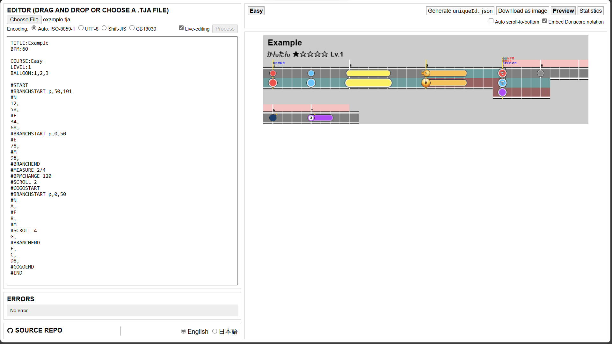
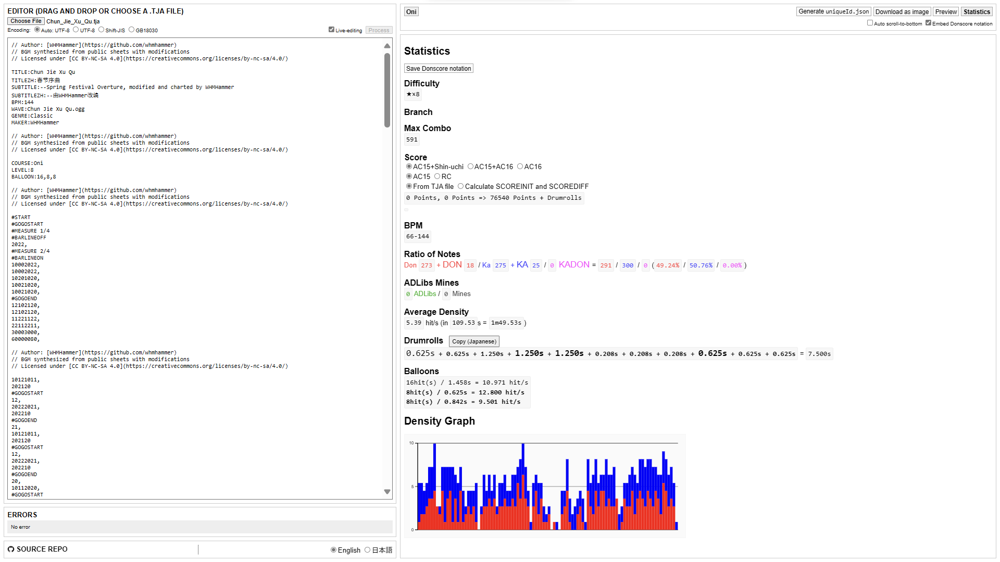

# TJA Tools

[日本語](README.md) [中文](README-CH.md) English

A tool to visualize `.tja` chart files.
Forked from [Snack](https://github.com/Snack-X)'s [tja-tools](https://github.com/Snack-X/tja-tools);
based on [WHMHammer](https://github.com/WHMHammer)'s [tja-tools](https://github.com/WHMHammer/tja-tools) (this fork);
based on [Dannal65535](https://github.com/Dannal65535)'s [tja-tools](https://github.com/Dannal65535/tja-tools);
based on [sakurada0291](https://github.com/sakurada0291)'s [tja-tools-tl](https://github.com/sakurada0291/tja-tools-tl).


## Run

Visit https://whmhammer.github.io/tja-tools

## Build

Install Node: https://nodejs.org/en/download, and then execute the following commands:

```
git clone https://github.com/WHMHammer/tja-tools
cd tja-tools
npm i
npm run build
```

You shall then open `webpack-dist/index.html` (not `src/index.html`) with your web browser or execute `npm start`

## Examples






## Progress

- [x] Manual Selection of file encoding
- [x] Show different branches side-by-side
- [ ] Show different players' chart side-by-side
- Meta (common)
    - [x] `TITLE`
    - [x] `SUBTITLE`
    - [x] `BPM`
    - [x] `MAKER`
    - [x] `GENRE`
- Meta (varing per-course)
    - `COURSE`
        - [x] `Easy` / `0`
        - [x] `Normal` / `1`
        - [x] `Hard` / `2`
        - [x] `Oni` / `3`
        - [x] `Edit` / `Ura` / `4`
        - [ ] `Tower` / `5`
        - [ ] `Dan` / `6`
    - [x] `LEVEL`
    - [x] `BALLOON`
    - [x] `STYLE` (with each player's chart as an isolated difficulty)
    - [x] `NOTESDESIGNER0` - `NOTESDESIGNER6` (only 0-4 are recognized)
- Notes
    - [x] `0` (empty)
    - [x] `1` (Don)
    - [x] `2` (Ka)
    - [x] `3` (DON)
    - [x] `4` (KA)
    - [x] `5` (Drumroll starts)
    - [x] `6` (DRUMROLL starts)
    - [x] `7` (Balloon starts)
    - [x] `8` (drumroll/balloon ends)
    - [x] `9` (BALLOON starts)
    - [x] `A` (partner Don)
    - [x] `B` (partner Ka)
    - [x] `C` (Bomb)
    - [x] `D` (Fuse)
    - [x] `F` (ADLIB)
    - [x] `G` (Green/Purple)
    - [ ] `H` (DRUMROLL or Don-roll)
    - [ ] `I` (Drumroll or Ka-roll)
- Commands
    - [x] `#START`
        - [x] `P1`, `P2`, … (no upper limit of player number)
    - [x] `#END`
    - [x] `#MEASURE`
    - [x] `#BPMCHANGE`
    - [ ] `#DELAY`
    - [x] `#SCROLL`
    - [x] `#GOGOSTART`
    - [x] `#GOGOEND`
    - [x] `#BARLINEOFF`
    - [x] `#BARLINEON`
    - [x] `#BRANCHSTART`
    - [x] `#N`
    - [x] `#E`
    - [x] `#M`
    - [x] `#BRANCHEND`
    - [ ] `#LYRIC`
    - [ ] `#LEVELHOLD`
    - [ ] `#NEXTSONG`

## Additional Commands

- Meta (common)
    - `FONT` ([Dannal65535](https://github.com/Dannal65535))
    Change the font for the song title and difficulty.
        - `sans-serif`
        The font originally used in TJA Tools. Specified as `sans-serif`.
    - `TITLECOLOR` ([Dannal65535](https://github.com/Dannal65535))
    Set this to 1 or 2 to change the color of the song title according to the genre.
    1 for the darker color, and 2 for the lighter color.
    - `LEVELCOLOR` ([Dannal65535](https://github.com/Dannal65535))
    Set this to 1 or 2 to change the color of the difficulty text to match the difficulty.
    For 1, the Inner Oni difficulty will be in the same color as the Oni difficulty.
    - `LEVELURA` ([Dannal65535](https://github.com/Dannal65535))
    Set to 1 to change the combination of texts for Inner Oni difficulty.
    By default, `(裏譜面)` (Inner chart) is appended to the song title and the difficulty is `おに` (Oni).
    By setting the value of this command to 1, the original song title will be kept and the difficulty will be `おに裏` (Inner Oni).
    - `SPROLL` ([Dannal65535](https://github.com/Dannal65535))
    Change the head of the Kusudama note into another special note.
        - `potato`
        Into a potato note.
        - `denden`
        Into a pellet drum (den-den) note.
        - `suzudon`
        Into a bell (suzu) note.

- Meta (varing per-course)
    - `TTROWBEAT` ([Snack](https://github.com/Snack-X))
    Change the maximum number of beats per line from the default of 16.

- Commands
    - `#TTBREAK` ([Snack](https://github.com/Snack-X)), \
    `#NEWLINE` ([Dannal65535](https://github.com/Dannal65535))
    Wrap the line at the start of the bar with this command.
    Apart from the previously existing `#TTBREAK`,
    it now also supports `#newline` used in Donscore.
    - `#MOVEEVENT` ([Dannal65535](https://github.com/Dannal65535))
    Shift the vertical position (Y coordinate) of the BPM and HS information after this command.
    - `#COUNTCHANGE` ([Dannal65535](https://github.com/Dannal65535))
    Change the number of the next bar and on after this command.
    - `#AVOIDTEXTOFF`, `#AVOIDTEXTON` ([Dannal65535](https://github.com/Dannal65535))
    Prevent the vertical lines from overlapping the BPM and HS information after this command.

## Features

- Editor
    - Live editing ([Snack](https://github.com/Snack-X))
    If enabled, editing the TJA text will automatically update the preview and statistics tabs without the need to click the process button.
    - Auto scrolling to bottom ([WHMHammer](https://github.com/WHMHammer))
    If enabled, editing the TJA text will automatically scroll the preview and statistics tabs to the bottom.
    - Manually selecting or auto detecting file encoding ([WHMHammer](https://github.com/WHMHammer))
    - Embedding Donscore notation ([Dannal65535](https://github.com/Dannal65535))
    Embed the Donscore notation in the header of the chart image in the preview.
    If unchecked, the TJA notation for the selected difficulty will be embedded instead.
    In either case, you can extract it as a text file with `reverse.exe`.
    - Switching language ([Wei-Cheng Yeh (IID)](https://github.com/IepIweidieng))

- Preview
    - Generating `uniqueId.json` for OpenTaiko ([申しコミ](https://github.com/0auBSQ))
    - Saving images on phones ([申しコミ](https://github.com/0auBSQ), [Dannal65535](https://github.com/Dannal65535))

- Statistics
    - Saving Donscore notation ([Dannal65535](https://github.com/Dannal65535))
    Saves Donscore text as a file.

    - Difficulty star ([Dannal65535](https://github.com/Dannal65535))
    Difficulty star is displayed in the statistics.

    - Support of chart branching ([Dannal65535](https://github.com/Dannal65535))
    You can now select each branch to view its statistics.

    - BPM ([Dannal65535](https://github.com/Dannal65535))
    Min BPM&ndash;Max BPM are displayed.

    - Scoring ([Snack](https://github.com/Snack-X))
    In addition to AC15 scoring, it now supports Shin-uchi and AC16 scoring. ([Dannal65535](https://github.com/Dannal65535))
    You can now choose between the AC15 and RC score rounding methods for Go-Go Time sections. ([Dannal65535](https://github.com/Dannal65535))
    It now supports scoring parameter prediction. ([Dannal65535](https://github.com/Dannal65535))

    - Average density ([Snack](https://github.com/Snack-X))
    The original formula for calculating average density in TJA Tools was "(number of notes)/playing time",
    but it has now been changed to "(number of notes - 1)/playing time" used in the [譜面とかWiki (Chart and on Wiki)](https://wikiwiki.jp/taiko-fumen). ([Dannal65535](https://github.com/Dannal65535))

    - Copying drumroll texts ([Dannal65535](https://github.com/Dannal65535))
    Clicking the copy button next to the heading
    will copy the text of drumroll lengths in the format used in the [譜面とかWiki (Chart and on Wiki)](https://wikiwiki.jp/taiko-fumen).

# Acknowledgement

- [Snack](https://github.com/Snack-X): The original author of the project
- [WHMHammer](https://github.com/WHMHammer): The main maintainer of this fork version. Added initial English translation.
- [申しコミ](https://github.com/0auBSQ): Added support to `A`, `B`, `C`, `D`, `F`, and `G` notes. Added display of subtitle and chart maker
- [Dannal65535](https://github.com/Dannal65535)：Added Support of showing different branches side-by-side. Made preview image compatible with Donscore. Added Japanese translation.
- [sakurada0291](https://github.com/sakurada0291): Added English translation
