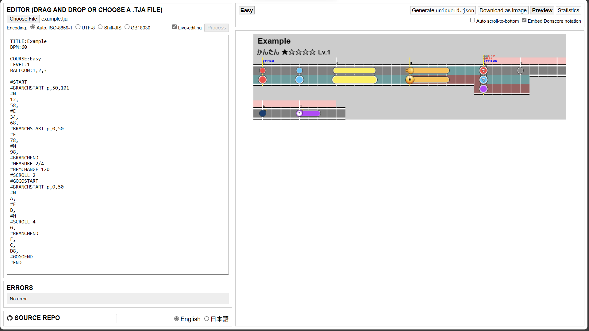
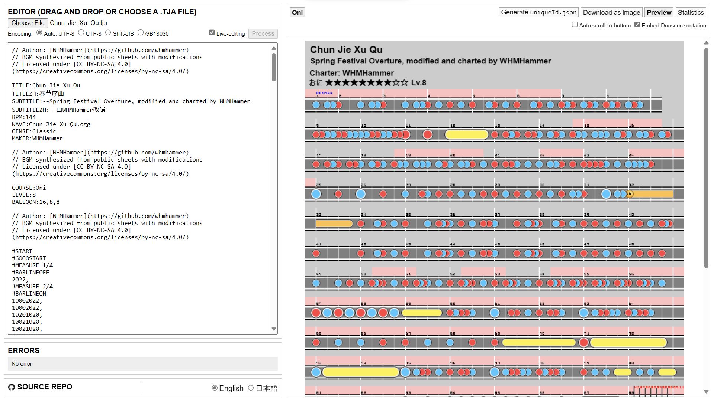
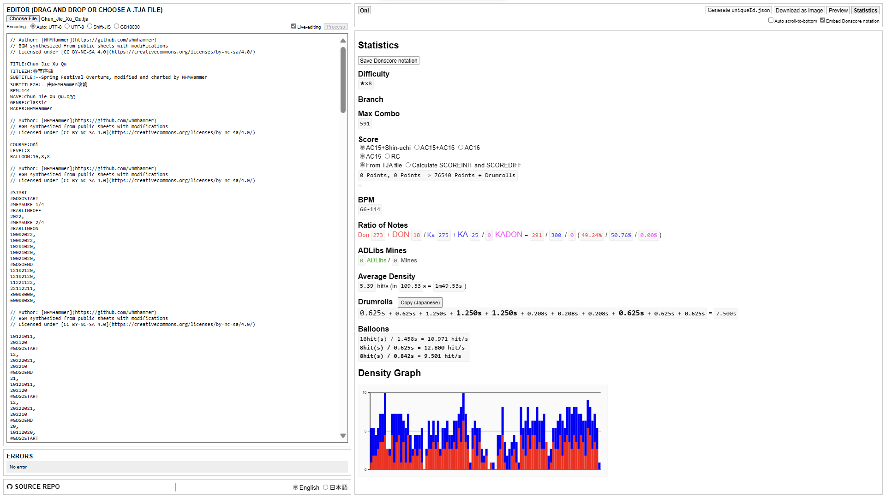

# TJA Tools

[English](../README.md) 日本語 [中文](README-CH.md)


`.tja` 譜面ファイルを可視化するツールです。 \
[Snack](https://github.com/Snack-X)様の[tja-tools](https://github.com/Snack-X/tja-tools)をフォーク； \
[WHMHammer](https://github.com/WHMHammer)様の[tja-tools](https://github.com/WHMHammer/tja-tools)をベース； \
[Dannal65535](https://github.com/Dannal65535)様の[tja-tools](https://github.com/Dannal65535/tja-tools)をベース； \
[sakurada0291](https://github.com/sakurada0291)様の[tja-tools-tl](https://github.com/sakurada0291/tja-tools-tl)をベース； \
[KirisameVanilla](https://github.com/KirisameVanilla)様の[tja-tools-web](https://github.com/KirisameVanilla/tja-tools-web)（本フォーク）をベース。

## サイト

<https://whmhammer.github.io/tja-tools> にアクセスしてください。

## ビルド

Nodeをインストールする：<https://nodejs.org/ja/download>、それから下みたいな感じでやれば出来るらしい：

```shell
git clone https://github.com/WHMHammer/tja-tools
cd tja-tools
npm i
npm run build
```

ビルドが終わったら、直下にある`webpack-dist/index.html`を開くか、`npm start` を実行すると、ツールが起動します。 \
（`src/index.html`ではないので注意。）

## 例







## 進捗

- [x] 文字コードを指定する
- [x] 異なる分岐を並べて表示する
- [ ] 異なるプレイヤー側を並べて表示する
- ヘッダ（譜面全体）
  - [x] `TITLE`
  - [x] `SUBTITLE`
  - [x] `BPM`
  - [x] `MAKER`
  - [x] `GENRE`
- ヘッダ（難易度ごと変更可能）
  - `COURSE`
    - [x] `Easy` / `0`
    - [x] `Normal` / `1`
    - [x] `Hard` / `2`
    - [x] `Oni` / `3`
    - [x] `Edit` / `Ura` / `4`
    - [ ] `Tower` / `5`
    - [ ] `Dan` / `6`
  - [x] `LEVEL`
  - [x] `BALLOON`
  - [x] `STYLE`（各プレイヤー側を別難易度扱い）
  - [x] `NOTESDESIGNER0` ~ `NOTESDESIGNER6`（0～4のみ有効）
- ノーツ
  - [x] `0`（なし）
  - [x] `1`（面）
  - [x] `2`（縁）
  - [x] `3`（大面）
  - [x] `4`（大縁）
  - [x] `5`（黄色連打始点）
  - [x] `6`（大黄色連打始点）
  - [x] `7`（風船音符始点）
  - [x] `8`（連打・風船終点）
  - [x] `9`（くすだま音符始点）
  - [x] `A`（手つなぎ大面）
  - [x] `B`（手つなぎ大縁）
  - [x] `C`（爆弾音符）
  - [x] `D`（紫風船音符）
  - [x] `F`（アドリブ音符）
  - [x] `G`（紫音符）
  - [ ] `H`（大黄色連打か面連打始点）
  - [ ] `I`（黄色連打か縁連打始点）
- コマンド
  - [x] `#START`
    - [x] `P1`, `P2`, …（プレイヤー番号は上限なし）
  - [x] `#END`
  - [x] `#MEASURE`
  - [x] `#BPMCHANGE`
  - [ ] `#DELAY`
  - [x] `#SCROLL`
  - [x] `#GOGOSTART`
  - [x] `#GOGOEND`
  - [x] `#BARLINEOFF`
  - [x] `#BARLINEON`
  - [x] `#BRANCHSTART`
  - [x] `#N`
  - [x] `#E`
  - [x] `#M`
  - [x] `#BRANCHEND`
  - [ ] `#LYRIC`
  - [ ] `#LEVELHOLD`
  - [ ] `#NEXTSONG`

## 追加命令

- ヘッダ（譜面全体）
  - `FONT`（[Dannal65535](https://github.com/Dannal65535)様） \
      曲名と難易度のフォントを変更することが出来ます。
    - `sans-serif` \
          TJA Toolsで元々使用されていたフォントです。`sans-serif`が使用されます。
  - `TITLECOLOR`（[Dannal65535](https://github.com/Dannal65535)様） \
      1または2にすることで曲名をジャンルに応じた色に変えることが出来ます。 \
      1は濃い目の色、2は明るめの色になっています。
  - `LEVELCOLOR`（[Dannal65535](https://github.com/Dannal65535)様） \
      1または2にすることで難易度の文字列を難易度に応じた色に変えることが出来ます。 \
      1にするとおに裏がおにと同じ色になります。
  - `LEVELURA`（[Dannal65535](https://github.com/Dannal65535)様） \
      1にすることでおに裏の時の文字列の組み合わせが変化します。 \
      通常は曲名に`(裏譜面)`を追加し、難易度を`おに`と表記しますが、
      この命令の値を1にすることで、曲名はそのままで、難易度を`おに裏`と表記します。
  - `SPROLL`（[Dannal65535](https://github.com/Dannal65535)様） \
      くすだま音符の始点を他の特殊な音符に変えることが出来ます。
    - `potato` \
          いも音符になります。
    - `denden` \
          でんでん音符になります。
    - `suzudon` \
          すずどん音符になります。

- ヘッダ（難易度ごと変更可能）
  - `TTROWBEAT`（[Snack](https://github.com/Snack-X)様） \
      1行あたりの最大拍数を16拍から変更することが出来ます。

- コマンド
  - `#TTBREAK`（[Snack](https://github.com/Snack-X)様）、
      `#NEWLINE`（[Dannal65535](https://github.com/Dannal65535)様） \
      このコマンドがあるところで改行させることが出来ます。小節の途中でも使用出来ます。 \
      元々`#TTBREAK`は存在していましたが、
      どんすこあで使用されている`#newline`にも対応しました。
  - `#MOVELINE`（[Dannal65535](https://github.com/Dannal65535)様、[Wei-Cheng Yeh (IID)](https://github.com/IepIweidieng) 様） \
      このコマンドがあるの行と以降の行の縦位置(Y座標)をずらすことが出来ます。
  - `#MOVEEVENT`（[Dannal65535](https://github.com/Dannal65535)様） \
      このコマンド以降のBPMやHSの情報の縦位置(Y座標)をずらすことが出来ます。
  - `#COUNTCHANGE`（[Dannal65535](https://github.com/Dannal65535)様） \
      このコマンドの次の小節数を変更することが出来ます。
  - `#AVOIDTEXTOFF`、`#AVOIDTEXTON`（[Dannal65535](https://github.com/Dannal65535)様） \
      このコマンド以降のBPMやHSの情報に縦線が被らないように出来ます。（デフォルトはON）

## 仕様

- エディタ
  - 更新の自動反映（[Snack](https://github.com/Snack-X)様） \
      有効にすると、TJAテキストを編集すると、反映ボタンをクリックすることなく、プレビューと統計タブが自動的に更新されます。
  - 下へ自動スクロールする ([WHMHammer](https://github.com/WHMHammer)様) \
      有効にすると、TJA テキストを編集すると、プレビューと統計タブが自動的に一番下までスクロールします。
  - 文字コードの指定と自動認識（[WHMHammer](https://github.com/WHMHammer)様）
  - どんすこあ構文を埋め込む（[Dannal65535](https://github.com/Dannal65535)様） \
      プレビューでの譜面画像のヘッダにどんすこあのテキストを埋め込むことが出来ます。 \
      チェックを外すと選んだ難易度分のTJAテキストが埋め込まれます。 \
      どちらの場合でも`reverse.exe`でテキストファイルとして取り出すことが出来ます。
  - 言語の切り替え（[Wei-Cheng Yeh (IID)](https://github.com/IepIweidieng) 様）

- プレビュー
  - OpenTaiko用の`uniqueId.json`を生成する（[申しコミ](https://github.com/0auBSQ)様）
  - スマホでの画像保存対応（[申しコミ](https://github.com/0auBSQ)様、[Dannal65535](https://github.com/Dannal65535)様）

- 統計
  - どんすこあ構文を保存（[Dannal65535](https://github.com/Dannal65535)様） \
      どんすこあのテキストをファイルとして保存します。

  - 難易度（[Dannal65535](https://github.com/Dannal65535)様） \
      難易度が統計に表示されます。

  - 譜面分岐対応（[Dannal65535](https://github.com/Dannal65535)様） \
      分岐を選んでそれぞれの統計が見れるようになりました。

  - BPM（[Dannal65535](https://github.com/Dannal65535)様） \
      最低BPM-最高BPMが表示されます。

  - 配点（[Snack](https://github.com/Snack-X)様） \
      AC15配点以外に、真打やAC16配点にも対応しました。（[Dannal65535](https://github.com/Dannal65535)様） \
      ゴーゴーの配点切り捨て方式をAC15方式とRC方式から選べるようになりました。（[Dannal65535](https://github.com/Dannal65535)様） \
      配点の予測機能を追加しました。（[Dannal65535](https://github.com/Dannal65535)様）

  - 平均密度（[Snack](https://github.com/Snack-X)様） \
      元々TJA Toolsでの平均密度の計算式は「(音符数)/演奏時間」でしたが、
      [譜面とかWiki](https://wikiwiki.jp/taiko-fumen)で使用している「(音符数-1)/演奏時間」に変更しました。（[Dannal65535](https://github.com/Dannal65535)様）

  - 連打のテキストコピー（[Dannal65535](https://github.com/Dannal65535)様） \
      見出し横のコピーボタンをクリックすると、
      [譜面とかWiki](https://wikiwiki.jp/taiko-fumen)で書かれている形式で連打秒数のテキストをコピーできます。


## スペシャルサンクス

- [Snack](https://github.com/Snack-X)様：ツールの製作者
- [WHMHammer](https://github.com/WHMHammer)様：初期の英語翻訳を追加。
- [申しコミ](https://github.com/0auBSQ)様：`A`、`B`、`C`、`D`、`F`、`G`の音符の追加、サブタイトルと譜面制作者の表示の追加。
- [Dannal65535](https://github.com/Dannal65535)様：異なる分岐を並べて表示、どんすこあとのプレビュー画像の互換性、日本語翻訳と追加どんすこあスプライト画像の追加。
- [sakurada0291](https://github.com/sakurada0291)様：英語翻訳の追加。
- [KirisameVanilla](https://github.com/KirisameVanilla)様：本フォークの主なメンテナ、簡体字中国語翻訳とi18nモジュールの抽出を追加。
- わの人 様：どんすこあの原作者
- rocktyt 様：どんすこあの後続開発者
- aestivalis(あきら氏) 様：どんすこあスプライト画像の元提供者
